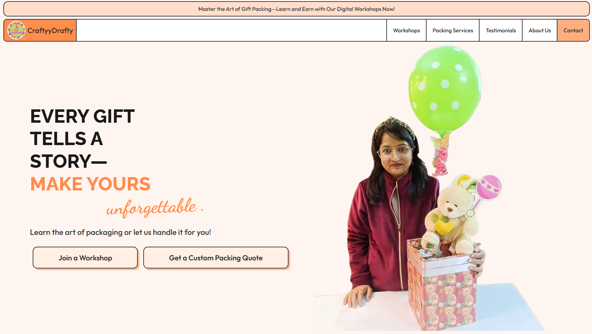
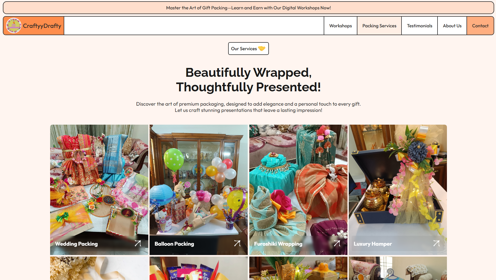
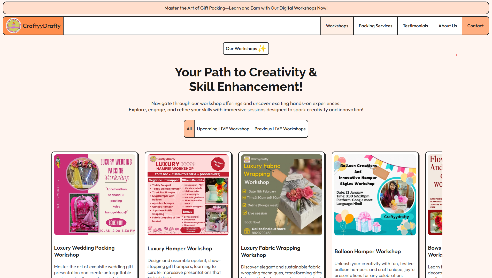
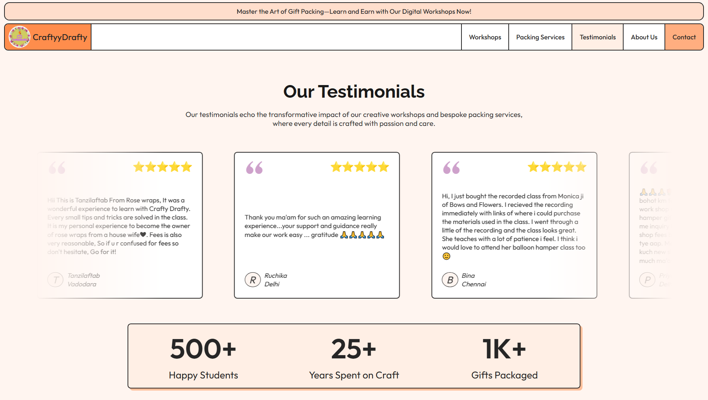

# CraftyyDrafty

CraftyyDrafty is a modern and responsive website built for a brand that specializes in creative packaging services and masterclasses. This project was designed to establish a strong online presence for the brand, enabling them to showcase their services, workshops, and testimonials to a wider audience. The entire user interface was first designed in Figma and then developed using ReactJS.

**LIVE** @[craftyydrafty.in](https://craftyydrafty.in)

## Features

* **Responsive Design:** Fully responsive design that works on all devices, from mobile phones to desktops.
* **Component-Based Architecture:** Built with a modular and reusable component-based architecture for easy maintenance and scalability.
* **React Router:** Utilizes `react-router-dom` for seamless navigation between different sections of the website, including Home, About Us, Workshops, Services, and Testimonials.
* **Interactive UI:** Engaging and interactive user interface with animations and hover effects to enhance the user experience.

## Tech Stack

* **Frontend:** React.js
* **Routing:** React Router DOM
* **Styling:** CSS
* **Designing:** Figma

## Screenshots

Here are a few screenshots of the Work.

<!-- | Screenshot 1 | Screenshot 2 | -->
| **Homepage** | **Services Section** |
| :---: | :---: |
|  |  |

<!-- | Screenshot 3 | Screenshot 4 | -->
| **Workshops** | **Testimonials** |
| :---: | :---: |
|  |  |
